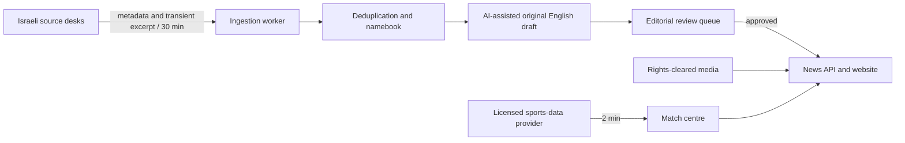

# Israel Sports Pulse

**Israel Sports Pulse (ILSP)** is an original, mobile-first English newsroom for Israeli sport. The local product combines independently written Israeli reporting, a controlled editorial desk, live-score adapters and a selective international sports corner.

## Product identity

The approved masterbrand is **Israel Sports Pulse**, shortened to **ILSP**, with the line **“The beat of Israeli sport.”** The complete name is used wherever readers, funders and partners first encounter the publication. ILSP is the compact mark for mobile icons, alerts, apps and social shorthand.

Point-in-time registry checks performed on 15 July 2026 returned no registration record for the agreed domain system. Availability and possible premium pricing are not guaranteed until registration.

1. `ilsportspulse.com` — recommended public address.
2. `ilpulse.co.il` — Israeli-market protection and redirect.
3. `ilsportspulse.com` — abbreviated-name protection and redirect.

No domain has been purchased. Registration, trademark clearance and external account creation remain explicit approval gates.

## What is implemented

- Responsive homepage with an impact-ranked Israeli lead, live score rail, category filters, search, dark mode, trending stories, ILSP columns, international coverage and mobile bottom navigation.
- Article pages with institutional desk bylines, story-specific imagery, key details and permanent routes; internal source, verification and production metadata never enters the public article API.
- Scores centre with sport and competition filters, separate league sections, full matchday schedules, expandable match records, standings and real club crests. Line-ups, incidents and statistics have explicit unavailable states until a licensed provider supplies them; the browser checks every two minutes.
- A keyless TheSportsDB adapter now supplies verified Israeli Premier League and Liga Leumit schedules, recent results, team marks and completed tables by default. Existing FeedTheBet/OpticOdds and multi-season Sportmonks adapters remain available.
- A 30-minute newsroom worker that gives ONE and Sport5 the largest new-candidate ceilings without excluding other desks: up to 10 each from ONE and Sport5, five from Walla Sport, and four each from Ynet Sport and Sport1/Maariv. It observes per-source delays and `robots.txt`, scans beyond previously seen links, maintains a persistent discovery ledger, excludes reports older than the 24-hour news window, consolidates cross-outlet reports under a canonical event key and sends new work to review by default.
- A separate voice audit measures length, paragraph architecture, sentence rhythm, stock phrasing and excessive publisher attribution. Future drafts choose their depth and structure from the event rather than following a fixed six-paragraph template.
- A verified Hebrew-to-English namebook for clubs, athletes and sports terms.
- A rights-aware media model with local Creative Commons photographs, visible creator/license credits, full-frame presentation and a labelled archival fallback for every published story.
- A daily historical feature and interactive five-question news quiz. The newsroom automation creates one of each per Jerusalem calendar day and embeds archive video only from a credible rights holder.
- Permanent chronological indexes keep every published report, archive feature and column available after homepage priorities change.
- Coverage taxonomy for the full Israeli football pyramid, basketball divisions, women and youth, handball, volleyball, judo and Olympic sports, plus World Cup, NBA, Olympics, tennis and Tour de France.

## Architecture



The news and score pipelines stay separate. A news source never becomes the authority for a live score; a score provider never becomes an editorial source.

## Local start

```bash
npm install
cp .env.example .env.local
npm run dev
```

The site opens at `http://localhost:3000`. No keys are required for the polished local preview. `npm run dev` starts the website. The Codex newsroom automation owns the 30-minute cycle in normal local use; set `ILSP_LOCAL_SCHEDULER=1` only when a separate standalone worker is deliberately required.

Run the checks:

```bash
npm run check
```

Inspect source candidates without calling the AI copy desk:

```bash
npm run ingest:dry
```

Start the standalone 30-minute worker:

```bash
npm run scheduler
```

## Newsroom configuration

Sources live in `config/sources.json`. Each source is restricted to metadata and a short, original summary. The worker:

1. checks `robots.txt` and fails closed if it cannot verify permission;
2. observes a source-specific delay;
3. scans source links and separates first-seen, previously seen, stale and existing-story matches;
4. counts only fresh first-seen URLs as candidates, then drops semantic duplicates and merges different editorial angles that share a canonical event key;
5. uses only a bounded, transient source excerpt;
6. produces a substantial original English report—not a full or sentence-by-sentence translation;
7. checks unfamiliar names against official club, federation, league or competition records;
8. assigns editorial impact so soft features cannot become the homepage lead merely because they are newer;
9. saves new work with `status: "review"` unless explicit auto-publish rules are enabled.

Set `OPENAI_API_KEY` to activate the AI-assisted draft stage. `NEWSROOM_AUTO_PUBLISH` is `false` by default and should remain false until the review interface, monitoring and publisher permissions are production-ready.

### Current source-connectivity status

The verified 16 July 2026 dry run scanned 216 links and reported 24 genuinely new candidates, 55 previously seen links, 26 stale items and 11 matches to stories already in the edition, with zero source errors. The former repeated figure of 33 was the sum of per-source ceilings, not a trustworthy measure of new material; the persistent discovery ledger and explicit disposition counters correct that ambiguity. ONE uses its advertised RSS feed. Sport5 uses its advertised news sitemap and falls back to its public section page if the sitemap CDN is temporarily unavailable. A dated local copy of a publisher’s exact public robots policy may be used for up to 30 days when its CDN temporarily fails; it is never treated as permanent permission. Written publisher agreements remain a production gate.

## Live sports data

`SPORTS_DATA_PROVIDER` accepts:

- `thesportsdb` — the keyless default: verified Israeli top-flight and Liga Leumit schedules, recent results, team marks and completed football tables. It does not pretend to provide the missing two-minute incident/line-up layer;
- `demo` — an honest empty state with no sample scores presented as real;
- `elite` — reuses the existing FeedTheBet/OpticOdds read API for multisport fixtures and scores; standings remain preview-only until its standings endpoint is mapped;
- `sportmonks` — football scores, fixtures and one or many Israeli league tables. Configure the complete football pyramid with `SPORTMONKS_ISRAEL_SEASONS`.

The practical production shortlist is [API-Football](https://www.api-football.com/pricing) for football depth, [Sportmonks](https://www.sportmonks.com/football-api/) or Sportradar for a contracted professional feed, and [TheSportsDB](https://www.thesportsdb.com/docs_pricing.php) for the current low-cost prototype path. API-Football’s free 100-request daily allowance cannot sustain a two-minute poll, which requires up to 720 checks per day before competition expansion. TheSportsDB’s premium tier advertises two-minute live scores for selected sports, but exact Israeli competition coverage and display rights must be confirmed before purchase.

Do not expose sportsbook credentials in this project. Do not enable a provider publicly until its contract explicitly allows editorial display and redistribution. Neither SofaScore nor Flashscore publishes a developer API suitable for this integration, so their private web endpoints are not scraped. For production breadth across basketball, tennis, cycling and the Olympics, license a multisport package or add sport-specific official feeds behind the same adapter.

## Image and social policy

- Use owned photography, properly licensed agency/editorial images, Creative Commons files with all conditions preserved, or official social embeds.
- Never download a source article’s photograph merely because it appears in `og:image`.
- Every media object stores its creator, source page, licence, licence URL, caption and any crop/colour changes.
- Label archival or representative images so they do not imply they depict the current event.
- Social posts should use the platform’s official embed/oEmbed method and keep the account, original post and platform visible.

See `public/media/CREDITS.md` for the prototype’s full photo ledger.

Preview football crests are loaded from FootyLogos for editorial identification with source credit in the score centre. Club marks remain the trademarks of their owners. Connected provider logo URLs take precedence in live mode.

## Production gates

Before publishing publicly: obtain written source/feed permissions, register the final brand/domain, connect a licensed score provider, build the editor review UI and corrections log, add authentication and audit history, configure a database/object store, add observability and alerts, complete legal/privacy/terms pages, and replace `robots: noindex` in `app/layout.tsx` only after those gates pass.
